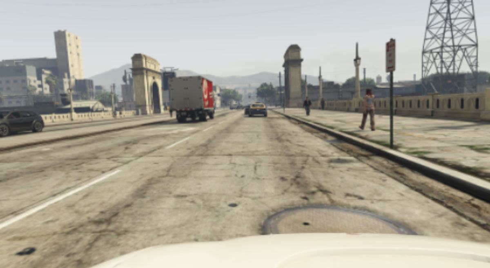
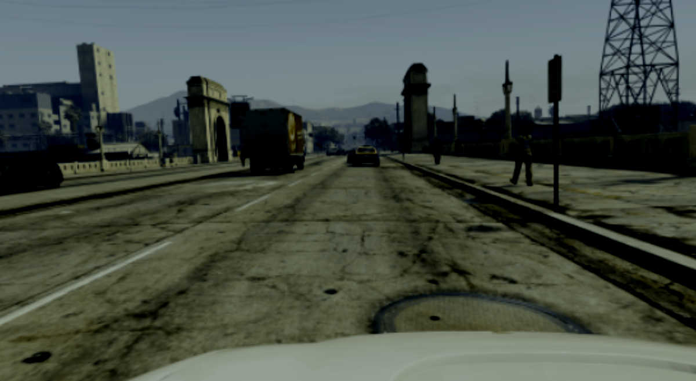

# QuDiDA (QUick and DIrty Domain Adaptation)

QuDiDA is a micro library for very naive though quick pixel level image domain adaptation via `scikit-learn` transformers.

## Installation
```
pip install git+https://github.com/arsenyinfo/qudida
```

## Usage 
```
import cv2

from sklearn.decomposition import PCA
from qudida import DomainAdapter

adapter = DomainAdapter(transformer=PCA(n_components=1), ref_img=cv2.imread('target.png'))
source = cv2.imread('source.png')
result = adapter(source)
cv2.imwrite('../result.png', result)
```

## Example 
Source image: 

Target image (style donor):

Result with PCA adaptation:
